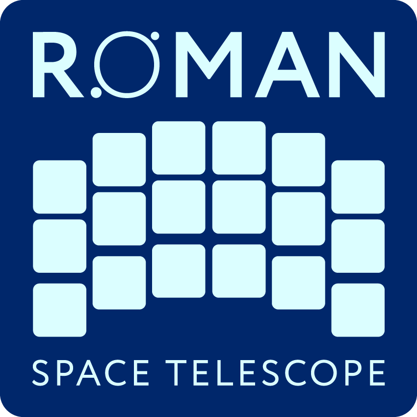

<a href="https://stsci.edu">
  
  
</a>
<a href="https://science.nasa.gov/mission/webb/">
  
</a>

# Nancy Grace Roman Space Telescope Calibration Pipeline

[](https://zenodo.org/badge/latestdoi/60551519)
[](https://pypi.org/project/romancal)
[](https://pypi.org/project/romancal/)
[](https://www.stsci.edu)
[](https://www.astropy.org/)
[](https://github.com/pre-commit/pre-commit)
[](https://github.com/astral-sh/ruff)
[](https://github.com/spacetelescope/romancal/actions/workflows/build.yml)
[](https://github.com/spacetelescope/romancal/actions/workflows/tests.yml)
[](https://roman-pipeline.readthedocs.io/en/latest/?badge=latest)
[](https://codecov.io/gh/spacetelescope/romancal)

This package (`romancal`) processes uncalibrated data from both imagers and spectrographs onboard the [Nancy Grace Roman Space Telescope (Roman)](https://science.nasa.gov/mission/roman-space-telescope/), an orbiting infrared observatory stationed at Earth-Sun L<sub>2</sub>.
The pipeline performs a series of calibration steps that result in standard data products usable for science.

Detailed explanations of specific calibration stages, reference files, and pipeline builds can be found on the [ReadTheDocs pages](https://roman-pipeline.readthedocs.io) and [RDox](https://roman-docs.stsci.edu/data-handbook-home/roman-data-pipelines).

> [!NOTE]
> If you have trouble installing this package, have encountered a bug while running the pipeline, or wish to request a new feature,
> please [open an issue on GitHub](https://github.com/spacetelescope/romancal/issues) or [contact the Roman Telescope Help Desk](https://romanhelp.stsci.edu).

<!--toc:start-->
- [Quick Start](#quick-start)
  - [1. Install the Pipeline](#1-install-the-pipeline)
    - [Option: Build Pipeline Directly from Source Code](#option-build-pipeline-directly-from-source-code)
    - [Option: Install Exact Operational Environment](#option-install-exact-operational-environment)
  - [2. Set up the Calibration Reference Data System (CRDS)](#2-set-up-the-calibration-reference-data-system-crds)
  - [3. Run the Pipeline](#3-run-the-pipeline)
- [Code Contributions](#code-contributions)
- [DMS Operational Build Versions](#dms-operational-build-versions)
<!--toc:end-->

## Quick Start

### 1. Install the Pipeline

> [!IMPORTANT]
> The Roman Telescope calibration pipeline currently supports Linux and macOS.
> Native Windows builds are **not** currently supported; [use WSL instead](https://stenv.readthedocs.io/en/latest/windows.html).

We recommend using an isolated Python environment to install `romancal`.
Python "environments" are isolated Python installations, confined to a single directory, where you can install packages, dependencies, and tools without cluttering your system Python libraries.
You can manage environments with `mamba` / `conda`, `virtualenv`, `uv`, etc.

These instructions assume you are creating Conda environments with the `mamba` command
(see [Miniforge for installation instructions](https://github.com/conda-forge/miniforge/blob/main/README.md));
to use `conda` instead, simply replace `mamba` with `conda` in the following commands.

First, create an empty environment with Python installed:
```shell
mamba create -n romancal_env python=3.13
```

Then, **activate** that environment (necessary to be able to access this isolated Python installation):
```shell
mamba activate romancal_env
```

Finally, install `romancal` into the environment:
```shell
pip install romancal
```

Without a specified version, `pip` defaults to the latest released version that supports your environment.
To install a specific version of `romancal`, explicitly set that version in your `pip install` command:
```shell
pip install romancal==0.22.0
```

To install a different version of `romancal`, simply create a new environment for that version:
```shell
mamba create -n romancal0.22_env python=3.13
mamba activate romancal0.22_env
pip install romancal==0.22

mamba create -n romancal0.20_env python=3.12
mamba activate romancal0.20_env
pip install romancal==0.20
```

#### Option: Build Pipeline Directly from Source Code

To install the latest unreleased (and unstable) development version directly from the source code on GitHub:

```shell
pip install git+https://github.com/spacetelescope/romancal
```

#### Option: Install Exact Operational Environment

There may be occasions where you need to replicate the exact environment used for canonical calibration operations by STScI (e.g. for validation testing or debugging issues).
We package releases for operations [as environment snapshots that specify exact versions for both the pipeline and all dependencies](https://ssb.stsci.edu/stasis/releases/romancal/).

See the [DMS Operational Build Versions](#dms-operational-build-versions) table for the version of the pipeline corresponding to each operational build.
For example, use `romancal==0.22.0` for **DMS build 26Q2_B21**.
Also note that Linux and macOS systems require different snapshot files:
```shell
mamba env create --file https://ssb.stsci.edu/stasis/releases/romancal/ROMANDP-0.20.0/delivery/latest-py312-macos-arm64.yml
mamba activate ROMANDP-0.20.0-1-py312-macos-arm64
```

### 2. Set up the Calibration Reference Data System (CRDS)

Before running the pipeline, you must first set up your local machine to retrieve files from the [Calibration Reference Data System (CRDS)](https://roman-crds.stsci.edu/static/users_guide/index.html>)
CRDS provides calibration reference files for several telescopes, including Roman.

Set `CRDS_SERVER_URL` and `CRDS_PATH` to run the pipeline with access to reference files from CRDS:
```shell
export CRDS_SERVER_URL=https://roman-crds.stsci.edu
export CRDS_PATH=$HOME/data/crds_cache/
```

The pipeline will automatically download individual reference files and cache them in the `CRDS_PATH` directory.
**Expect to use 50 gigabytes (or more) of disk space for reference files**, depending on the instrument modes in use.

> [!TIP]
> Users within the STScI network do not need to set `CRDS_PATH` (it defaults to shared network storage).

To use a specific CRDS context other than that automatically associated with a given pipeline version, explicitly set the `CRDS_CONTEXT` environment variable:
```shell
export CRDS_CONTEXT=roman_0046.pmap
```

### 3. Run the Pipeline

Once installed, the pipeline allows users to run and configure calibration themselves for custom processing of Roman Telescope data,
either [from the command line with `strun`](https://roman-pipeline.readthedocs.io/en/latest/roman/pipeline_run.html#from-the-command-line)
or from Python with [pipeline and step functions and classes in the `romancal` package](https://roman-pipeline.readthedocs.io/en/latest/roman/pipeline_run.html#from-the-python-prompt).
Additionally, the `romancal` package provides [Roman Telescope datamodel classes](https://roman-pipeline.readthedocs.io/en/latest/roman/datamodels/models.html#about-datamodels),
the recommended method for reading and writing Roman Telescope data files in Python.

## Code Contributions

`romancal` is an open source package written in Python.
The source code is [available on GitHub](https://github.com/spacetelescope/romancal).
New contributions and contributors are very welcome!
Please read [`CONTRIBUTING.md`](CONTRIBUTING.md).

We strive to provide a welcoming community by abiding with our [`CODE_OF_CONDUCT.md`](CODE_OF_CONDUCT.md).

See [`TESTING.md`](./TESTING.md) for instructions on automated testing.

## DMS Operational Build Versions

The table below provides information on each release of the `romancal` package and its relationship to software builds used in STScI Roman Telescope DMS operations.
Each `romancal` tag was released on PyPI on the date given in `Date`.

| romancal tag | DMS build | CRDS_CONTEXT | Date      | Notes                                 |
|--------------|-----------|--------------|-----------|---------------------------------------|
| 0.22.0       | 26Q2_B21  | 046          | Feb 2026  | Release for Build 26Q2_B21 (Build 21) |
| 0.21.0       | 26Q1_B20  | 090          | Nov 2025  | Release for Build 26Q1_B20 (Build 20) |
| 0.20.1       | 25Q4_B19  | 088          | Aug 2025  | Release for Build 25Q4_B19 (Build 19) |
| 0.20.0       | 25Q4_B19  | 088          | Aug 2025  | Release for Build 25Q4_B19 (Build 19) |
| 0.19.0       | 25Q3_B18  | 083          | May 2025  | Release for Build 25Q3_B18 (Build 18) |
| 0.18.0       | 25Q2_B17  | 072          | Feb 2025  | Release for Build 25Q2_B17 (Build 17) |
| 0.17.0       | 25Q1_B16  | 065          | Nov 2024  | Release for Build 25Q1_B16 (Build 16) |
| 0.16.3       | 24Q4_B15  | 063          | Aug 2024  | Release for Build 24Q3_B15 (Build 15) |
| 0.16.2       | 24Q4_B15  | 063          | Aug 2024  | Release for Build 24Q3_B15 (Build 15) |
| 0.16.1       | 24Q4_B15  | 063          | Aug 2024  | Release for Build 24Q3_B15 (Build 15) |
| 0.16.0       | 24Q4_B15  | 063          | Aug 2024  | Release for Build 24Q3_B15 (Build 15) |
| 0.15.1       | 24Q3_B14  | 058          | May 2024  | Release for Build 24Q3_B14 (Build 14) |
| 0.15.0       | 24Q3_B14  | 058          | May 2024  | Release for Build 24Q3_B14 (Build 14) |
| 0.14.0       | 24Q2_B13  | 056          | Feb 2024  | Release for Build 24Q2_B13 (Build 13) |
| 0.13.0       | 24Q1_B12  | 052          | Nov 2023  | Release for Build 24Q1_B12 (Build 12) |
| 0.12.0       | 23Q4_B11  | 051          | Aug 2023  | Release for Build 23Q4_B11 (Build 11) |
| 0.11.0       | 23Q3_B10  | 047          | May  2023 | Release for Build 23Q3_B10 (Build 10) |
| 0.10.0       | 23Q2_B9   | 041          | Feb  2023 | Release for Build 23Q2_B9 (Build 9)   |
| 0.9.0        | 23Q1_B8   | 039          | Nov  2022 | Release for Build 23Q1_B8 (Build 8)   |
| 0.8.1        | 22Q4_B7   | 038          | Aug  2022 | Release for Build 22Q4_B7 (Build 0.7) |
| 0.8.0        | 22Q4_B7   | 038          | Aug  2022 | Release for Build 22Q4_B7 (Build 0.7) |
| 0.7.1        | 22Q3_B6   | 032          | May  2022 | Release for Build 22Q3_B6 (Build 0.6) |
| 0.7.0        | 22Q3_B6   | 032          | May  2022 | Release for Build 22Q3_B6 (Build 0.6) |
| 0.6.0        | 0.5       | 030          | Mar  2022 | Release for Build 0.5                 |
| 0.5.0        | 0.4       | 023          | Dec  2021 | Release for Build 0.4                 |
| 0.4.2        | 0.3       | 011          | Sep  2021 | Release for Build 0.3                 |
| 0.3.1        | 0.2       | 007          | Jun  2021 | Release for Build 0.2 CRDS tests      |
| 0.3.0        | 0.2       | 007          | May  2021 | Release for Build 0.2                 |
| 0.2.0        | 0.1       | 004          | Mar  2021 | Release for Build 0.1                 |
| 0.1.0        | 0.0       | 003          | Nov  2020 | Release for Build 0.0                 |
