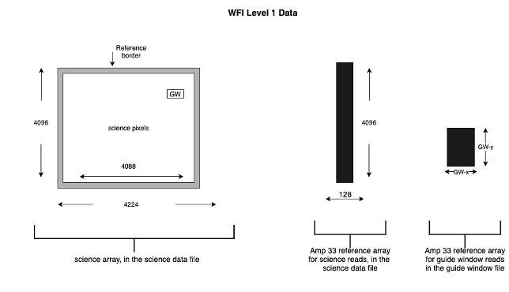

Science Products
----------------
The following sections describe the format and contents of each of the Roman ASDF science
products.

.. _uncal:

Uncalibrated raw data: ``uncal``
^^^^^^^^^^^^^^^^^^^^^^^^^^^^^^^^
Exposure raw data products are designated by a file name
suffix of "uncal." These files usually contain only the raw detector pixel values
from an exposure, with the addition of meta data associated with the exposure. The
resultantdq array is an optional array used to flag missing data in the data Formatting
process.

+--------------+----------+------------+-------+-------------------------------+
| data array   |          | Data Type  | Units | Dimensions                    |
+==============+==========+============+=======+===============================+
|  data        | Required | uint16     | DN    |  nresultants x nrows x ncols  |
+--------------+----------+------------+-------+-------------------------------+
|  amp33       | Required | uint16     | DN    |  nresultants x 4096 x 128     |
+--------------+----------+------------+-------+-------------------------------+
|  resultantdq | Optional | uint8      | N/A   |  nresultants x nrows x ncols  |
+--------------+----------+------------+-------+-------------------------------+

 - data: 3-D data array containing the raw pixel values. The first two dimensions are equal to
   the size of the detector readout, with the data from multiple resultants stored along the 3rd
   axis.

 - amp33: This is the reference output from a dedicated SCA Output that reads additional Reference
   Pixels on the SCA that are separate from the full-frame array read out by the Science Outputs.
   This Output is active in parallel with either the 32 Science Outputs or the 1 Guide Window Output.

 - resultantdq: An array that flags the location of any missing data discovered in
   the data formating process.

Ramp data: ``ramp``
^^^^^^^^^^^^^^^^^^^
As raw data progress through the :ref:`romancal.pipeline.ExposurePipeline <exposure_pipeline>` pipeline
they are stored internally in a `~romancal.datamodels.RampModel`.
This type of data model is serialized to a ``ramp`` type ASDF
file on disk. The original detector pixel values are converted
from integer to floating-point data type.  An ERR array and two
types of data quality arrays are also added to the product.
The ASDF file layout is as follows:

+----------------------+----------+------------+-----------+-------------------------------+
| data array           |          | Data Type  | Units     | Dimensions                    |
+======================+==========+============+===========+===============================+
|  data                | Required | float32    | e :sup:`-`|  nresultants x nrows x ncols  |
+----------------------+----------+------------+-----------+-------------------------------+
|  pixeldq             | Required | uint32     | N/A       |  nrows x ncols                |
+----------------------+----------+------------+-----------+-------------------------------+
|  groupdq             | Required | uint8      | N/A       |  nresultants x nrows x ncols  |
+----------------------+----------+------------+-----------+-------------------------------+
|  err                 | Required | float32    | e :sup:`-`|  nresultants x nrows x ncols  |
+----------------------+----------+------------+-----------+-------------------------------+
|  amp33               | Required | uint16     | DN        |  nresultants x 4096 x 128     |
+----------------------+----------+------------+-----------+-------------------------------+
| border_ref_pix_left  | Required | float32    | DN        |  nresultants x 4096 x 4       |
+----------------------+----------+------------+-----------+-------------------------------+
| border_ref_pix_right | Required | float32    | DN        |  nresultants x 4096 x 4       |
+----------------------+----------+------------+-----------+-------------------------------+
| border_ref_pix_top   | Required | float32    | DN        |  nresultants x 4 x 4096       |
+----------------------+----------+------------+-----------+-------------------------------+
| border_ref_pix_bottom| Required | float32    | DN        |  nresultants x 4 x 4096       |
+----------------------+----------+------------+-----------+-------------------------------+

 - data: 3-D data array containing the pixel values. The first two dimensions are equal to
   the size of the detector readout, with the data from multiple resultants stored along the 3rd
   axis.
 - pixeldq: 2-D data array containing DQ flags that apply to all groups and all resultants
   for a given pixel (e.g. a hot pixel is hot in all groups and resultants).
 - groupdq: 3-D data array containing DQ flags that pertain to individual reads within an
   exposure, such as the point at which a pixel becomes saturated within a given exposure.
 - err: 3-D data array containing uncertainty estimates.
 - amp33: Amp 33 reference pixel data.
 - border_ref_pix_left: Copy of original border reference pixels, on left (from viewers perspective).
 - border_ref_pix_right: Copy of original border reference pixels, on right (from viewers perspective).
 - border_ref_pix_top: Copy of original border reference pixels, on the top (from viewers perspective).
 - border_ref_pix_bottom: Copy of original border reference pixels, on the bottom (from viewers perspective).

.. Note::
   The reference pixels that are on the outer border of the science array are copied to these
   storage arrays (border_ref_pixel_<position>) at the dq_init step but are retained in
   the science array until being trimmed at the ramp fitting step.

Calibrated data: ``cal``
^^^^^^^^^^^^^^^^^^^^^^^^
The ``cal`` products are the result of runnng the :ref:`romancal.pipeline.ExposurePipeline <exposure_pipeline>`
and yields an `~romancal.datamodels.ImageModel`2-D.
Single exposure calibrated products contain many of the same arrays as the previous products.
The calibrated products are the result of an average over all integrations (``cal``).

+----------------------+----------+------------+-------------------------+-------------------------------+
| data array           |          | Data Type  | Units                   | Dimensions                    |
+======================+==========+============+=========================+===============================+
|  data                | Required | float32    | e\ :sup:`-`/ s          |  nrows x ncols                |
+----------------------+----------+------------+-------------------------+-------------------------------+
|  dq                  | Required | uint32     | N/A                     |  nrows x ncols                |
+----------------------+----------+------------+-------------------------+-------------------------------+
|  err                 | Required | float32    | e\ :sup:`-`/ s          |  nrows x ncols                |
+----------------------+----------+------------+-------------------------+-------------------------------+
|  var_poisson         | Required | float32    | e\ :sup:`-`/ s\ :sup:`2`|  nrows x ncols                |
+----------------------+----------+------------+-------------------------+-------------------------------+
|  var_rnoise          | Required | float32    | e\ :sup:`-`/ s\ :sup:`2`|  nrows x ncols                |
+----------------------+----------+------------+-------------------------+-------------------------------+
|  var_flat            | Required | float32    | e\ :sup:`-`/ s\ :sup:`2`|  nrows x ncols                |
+----------------------+----------+------------+-------------------------+-------------------------------+
|  amp33               | Required | uint16     | DN                      |  nresultants x 4096 x 128     |
+----------------------+----------+------------+-------------------------+-------------------------------+
| border_ref_pix_left  | Required | float32    | DN                      |  nresultants x 4096 x 4       |
+----------------------+----------+------------+-------------------------+-------------------------------+
| border_ref_pix_right | Required | float32    | DN                      |  nresultants x 4096 x 4       |
+----------------------+----------+------------+-------------------------+-------------------------------+
| border_ref_pix_top   | Required | float32    | DN                      |  nresultants x 4 x 4096       |
+----------------------+----------+------------+-------------------------+-------------------------------+
| border_ref_pix_bottom| Required | float32    | DN                      |  nresultants x 4 x 4096       |
+----------------------+----------+------------+-------------------------+-------------------------------+

 - data: 2-D data array containing the calibrated pixel values.
 - err: 2-D data array containing uncertainty estimates for each pixel.
   These values are based on the combined VAR_POISSON and VAR_RNOISE data (see below),
   given as standard deviation.
 - dq: 2-D data array containing DQ flags for each pixel.
 - var_poisson: 2-D data array containing the variance estimate for each pixel,
   based on Poisson noise only.
 - var_rnoise: 2-D data array containing the variance estimate for each pixel,
   based on read noise only.
 - var_flat: 2-D data array containing the variance estimate for each pixel,
   based on uncertainty in the flat-field.
 - amp33: Amp 33 reference pixel data.
 - border_ref_pix_left: Copy of original border reference pixels, on left (from viewers perspective).
 - border_ref_pix_right: Copy of original border reference pixels, on right (from viewers perspective).
 - border_ref_pix_top: Copy of original border reference pixels, on the top (from viewers perspective).
 - border_ref_pix_bottom: Copy of original border reference pixels, on the bottom (from viewers perspective).
