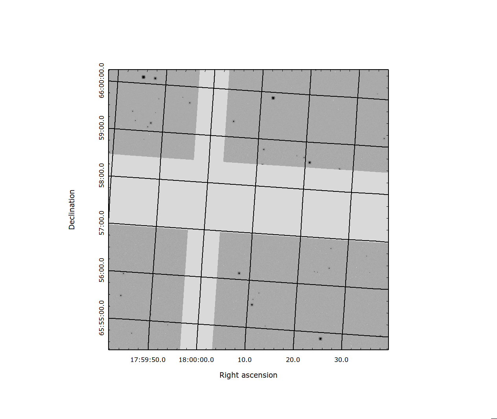

.. _mosaic_pipeline:

Mosaic Level Image Processing
=============================

:Class: `romancal.pipeline.MosaicPipeline`
:Alias: mosaic_pipeline

The ``MosaicPipeline`` applies corrections to an overlapping group of images
and is setup to process only imaging observations.
This pipeline is used to apply the flux scale factor, :ref:`flux <flux_step>`,
determine a common background, :ref:`skymatch <skymatch_step>`, detect pixels the are
not consistent with the other datasets, :ref:`outlier_detection <outlier_detection_step>`, resample the image to a
single undistorted image, :ref:`resample <resample_step>`, and to run :ref:`source_catalog <source_catalog_step>`
on the resulting corrected image.

The list of steps applied by the ``MosaicPipeline`` pipeline is shown in the
table below.

.. |check| unicode:: U+2713 .. checkmark
.. |xmark| unicode:: U+1D54F .. xmark

======================================================= ========= ========= =========
 Step                                                   WFI-Image WFI-Prism WFI-Grism
======================================================= ========= ========= =========
 :ref:`flux <flux_step>`                                |check|    |xmark|  |xmark|
 :ref:`skymatch <skymatch_step>`                        |check|    |xmark|  |xmark|
 :ref:`outlier_detection <outlier_detection_step>`      |check|    |xmark|  |xmark|
 :ref:`resample <resample_step>`                        |check|    |xmark|  |xmark|
 :ref:`source_catalog <source_catalog_step>`            |check|    |xmark|  |xmark|
======================================================= ========= ========= =========

Arguments
---------

For more details about step arguments (including datatypes, possible values
and defaults) see :py:obj:`romancal.pipeline.mosaic_pipeline.MosaicPipeline.spec`.

``--on_disk``
  When `True` the input association will be opened in a way that uses
  temporary files to avoid keeping all input models in memory.

``--resample_on_skycell``
  For outlier detection and resampling if the input association contains
  skycell information use it to compute the wcs to use for resampling.

You can see the options for strun using:

strun --help roman_mos

and this will list all the strun options as well as the step options for the roman_mos.

Inputs
--------

An association of 2D calibrated image data
++++++++++++++++++++++++++++++++++++++++++

:Data model: `~romancal.datamodels.WfiImage`
:File suffix: _cal

The input to the ``MosaicPipeline`` is a group of calibrated exposures,
e.g. "r0008308002010007027_0019_wfi01_cal.asdf", which contains the
calibrated data for the the exposures. The most convenient way to pass the list of
exposures to be processed with the mosaic level pipeline is to use an association.
Instructions on how to create an input association an be found at :ref:`asn-from-list`.

The mosaic pipeline can create different types of products. In one
mode you give it a list of calibrated images and the pipeline will run
the above steps and the final product is a mosaic of the input images
resampled to a regular grid.  The mode is selected based on the target
field in the association header.  If the input association contains a
target field which matches a skycell name (see TBD) then the mosaic
pipeline will resample the final product onto the skycell grid.

If the association has been generated with :ref:`skycell_asn` the
skycell name and projection coordinates should be available in the
association header.  If the skycell name is available and corresponds
to a valid name in the database and the projection cell coordinates
are not available in the association header then the pipeline will
read the needed information from the data file containing the skycell
information.

.. _figure-skycell-mosaic:

   Image showing the four SCA's that overlap a given skycell.

The projection of the single WFI exposure resampled to a skycell is shown in :numref:`figure-skycell-mosaic`.
The image has the portion of the four SCAs that overlap
the given skycell resampled to a regular grid on the WCS of the skycell. The gaps
between the images show the placement of the SCAs in the detector. In general
these gaps will be filled in by additional exposures in the visit.

If the target field does not contain a valid skycell name then the
image or images will be resampled to a regular grid. To resample a
single image the input will need to be an association with a single
member.

.. list-table::

   * - .. figure::  graphics/mosaic_regular_grid.png
          :name: figure-mosaic-regular-grid
          :scale: 25 %
          :align: left

	  An  SCA resampled to a regular grid.

     - .. figure::  graphics/mosaic4_regular_grid.png
          :name: figure-mosaic4-regular-grid
          :scale: 25 %

	  Four SCAs resampled to a regular grid.

.. labels in list-tables do no appear to be used outside the list-table structure, hard codeing for now.
.. :numref:`figure-mosaic-regular-grid` and :numref:`figure-mosaic4-regular-grid` show

Figures 2 & 3 show the results of the mosaic pipeline on a single SCA and on four SCA's in the WFI array.
Using the code to mosaic large areas of the sky may result on the code needing large amounts of memory,
so care is needed not to exceed your local memory limits when constructing mosaics in this manner.

Outputs
----------

2D Image (MosaicModel)
++++++++++++++++++++++

The resampled data can be found in

:Data model: `~romancal.datamodels.WfiMosaic`
:File suffix: _coadd

Catalog file (MosaicSourceCatalog)
+++++++++++++++++++++++++++++++++++

The catalog data is in

:Data model: `~romancal.datamodels.MosaicSourceCatalog`
:File suffix: _cat

Segmentation Map (SegmentationMapModel)
++++++++++++++++++++++++++++++++++++++++

The segmentation map is

:Data model: `~romancal.datamodels.MosaicSegmentationMapModel`
:File suffix: _segm

Result of applying all the mosaic level pipeline steps up through the
:ref:`source_catalog <source_catalog_step>` step is to produce data background corrected
and cleaned of outliers and resampled to a distortion free grid along with
the source catalog and segmentation map.
The coadd file is 2D image data, with additional attributes for the mosaicing information. The cat
file is an asdf file with the detected sources and the segmenation map is an asdf file
linking the input images to the detected sources.
