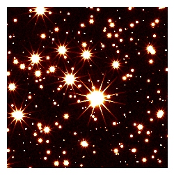

Generating Static Previews
==========================

Roman archiving requires static preview images for viewing and selecting images, with the
following requirements for each ``ImageModel``:

- 1080p x 1080p preview image
- 300p x 300p thumbnail image
- output as PNG files
- 90th percentile linear histogram stretch
- using ``afmhot`` colormap
- overlay indicating orientation

The ``roman_static_preview`` script creates downsampled images from ASDF files containing
an ``ImageModel``, with an optional compass rose overlaid onto the image indicating orientation.

Installation
------------

The requirements for this script are not installed by default as part of ``romancal``; install with
the ``sdp`` extra to include them.

.. code-block:: shell

	pip install "romancal[sdp]"

Usage
-----

``roman_static_preview`` includes two convenience commands, ``preview`` and ``thumbnail``, that set
default options to the static preview requirements.

.. code-block:: shell

	❯ roman_static_preview input.asdf output.png preview --help
	usage: roman_static_preview INPUT OUTPUT preview [-h] [--no-compass] SHAPE [SHAPE ...]

	positional arguments:
	  SHAPE         desired pixel shape of output image

	options:
	  -h, --help    show this help message and exit
	  --no-compass  do not draw a north arrow on the image

.. code-block:: shell

	❯ roman_static_preview thumbnail --help
	usage: roman_static_preview INPUT OUTPUT thumbnail [-h] [--compass] SHAPE [SHAPE ...]

	positional arguments:
	  SHAPE       desired pixel shape of output image

	options:
	  -h, --help  show this help message and exit
	  --compass   draw a north arrow on the image

Examples
--------

.. code-block:: shell

	roman_static_preview r0000501001001001001_0001_wfi01_cal.asdf r0000501001001001001_0001_wfi01_cal.png preview 400 400

.. image:: ../images/r0000501001001001001_0001_wfi01_cal.png
   :alt: preview of Roman imagery, with compass rose showing orientation

.. code-block:: shell

	roman_static_preview r0000501001001001001_0001_wfi01_cal.asdf r0000501001001001001_0001_wfi01_cal_thumb.png thumbnail

using ``stpreview`` directly
----------------------------

The ``roman_static_preview`` script is merely a wrapper over ``stpreview to``, which
offers more options for fine-grained control of the output image. ``stpreview`` offers
the ``to`` and ``by`` commands (for resampling ``to`` a desired image shape, or ``by``
a desired factor, respectively). Refer to `the documentation <https://github.com/spacetelescope/stpreview#usage>`_
for usage instructions.
